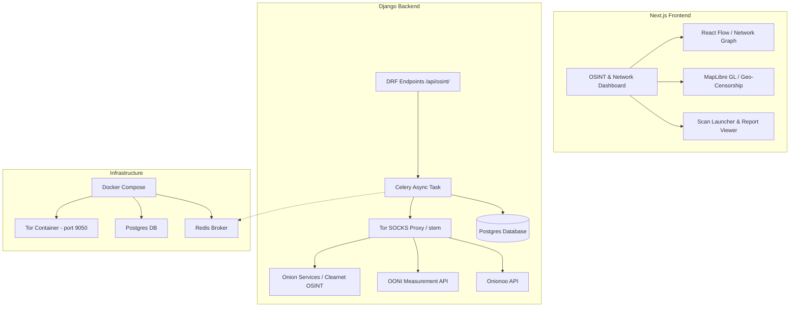

# Advanced OSINT & Tor Anomaly Detection Proposal

This document outlines the architecture, libraries, and integration plan to extend **ToRsy: The Buddy in the Dark** (Django + Next.js) with advanced OSINT (Open Source Intelligence), digital footprinting, and Tor network/censorship anomaly detection capabilities.

---

## 1. Core Objectives & Context

By combining your work in **Tor Traffic Analysis & Anomaly Detection** (using Onionoo, Nyx, and OONI Probe) with active **OSINT & Digital Footprinting**, we can build a unified dashboard. This system will map:
1. **Network Layer Security**: Censorship events (OONI), relay bandwidth fluctuations/anomalies (Onionoo), and connection health (Nyx).
2. **Application Layer Identity**: Credential leaks, domain threat footprints, metadata leaks in files, and cross-platform identity mapping (Sherlock style).
3. **Correlation Engine**: Correlating regional censorship anomalies or network blockages with darknet/onion service operational activity.

---

## 2. Advanced OSINT & Digital Footprint Use Cases

To extend ToRsy, we propose adding the following four analysis modules:

### A. Tor Relay & Censorship Cockpit (Network Anomaly)
- **Onionoo Anomaly Tracking**: Automatically fetch Onionoo data to track relay bandwidth spikes, sudden guard/exit node drop-offs (suggesting ISP blocking), or consensus weights.
- **OONI Probe Analysis**: Map network interference, DNS tampering, and website blockages per country/ASN.
- **Circuit Path Visualization**: Visualize the geographic hops of a Tor circuit from entry guard to middle relay to exit node.

### B. Dark Web (Onion Service) Crawler & Monitor
- **Targeted Onion Scraping**: Crawl specific `.onion` sites securely using a local Tor SOCKS proxy.
- **Breach & Leak Monitoring**: Scan known dark web paste sites and forums for leaks of specific domains, email formats, or API keys.

### C. Digital Footprint & Identity Resolver
- **Username Lookup (Sherlock)**: Check username availability and profile existence across 400+ platforms.
- **Email/Domain Breach Lookup**: Integrate passive lookup tools to check if email addresses or domains are present in public credential breaches.
- **Passive DNS & Asset Discovery**: Map subdomains, DNS records, and SSL/TLS certificates of a target domain to build an attack-surface graph.

### D. File Metadata & OpSec Analyzer
- **Document Scraper & EXIF Parser**: Read documents, PDFs, and images uploaded to or crawled by the dashboard, extracting metadata (e.g., software used, camera EXIF, GPS, author names) that leaks identity/OpSec.

---

## 3. Recommended Libraries & Tools

To implement these features, we recommend integrating the following specialized libraries:

### Python (Backend) Libraries

| Library | Primary Use Case | Description |
| :--- | :--- | :--- |
| **`stem`** | Tor Control & Descriptor Parsing | The official Python library to interact with the Tor controller (like Nyx does under the hood). Enables circuit construction, relay descriptor fetching, and proxy control. |
| **`scapy`** / **`pyshark`** | Traffic Analysis & PCAP Parsing | For reading network capture files, analyzing packet flows, extracting TLS handshakes, and calculating entropy to detect anomalies. |
| **`beautifulsoup4`** & **`playwright`** | SOCKS5-routed Web Scraping | Configured with `socks5h://127.0.0.1:9050` to retrieve and parse content from clearnet and `.onion` sites. |
| **`exifread`** & **`pdfplumber`** | Document Metadata Parsing | Extracts camera parameters, GPS coordinates, author metadata, and creation software from images and PDF files. |
| **`dnspython`** & **`shodan`** | Subdomain & Port Mapping | Performs DNS queries and interacts with Shodan/Censys to discover open ports, banners, and digital footprint exposures. |
| **`pandas`** & **`scikit-learn`** | Traffic Anomaly Detection | Applies unsupervised anomaly detection (e.g., Isolation Forest, One-Class SVM) on Onionoo traffic metrics or PCAP flow stats. |

### JavaScript / TypeScript (Next.js Frontend) Libraries

| Library | Primary Use Case | Description |
| :--- | :--- | :--- |
| **`@xyflow/react`** (React Flow) | Node-Link Graph Visualization | Visualizes digital footprint associations (e.g., `Username -> Twitter Profile`, `Domain -> IP -> SSL Cert`). Excellent for interactive OSINT mind-maps. |
| **`react-force-graph-2d`** | 3D/2D Network Graphs | High-performance Canvas/WebGL visualization for large Tor relay networks or complex circuit structures. |
| **`maplibre-gl`** & **`react-map-gl`** | Geo-Mapping & Hotspot Analysis | Maps Tor relays, exit nodes, and OONI censorship test failures on a vector world map. |
| **`recharts`** | Traffic/Bandwidth Charting | Renders real-time and historical bandwidth logs, circuit latencies, and traffic anomalies. |

---

## 4. Integration Architecture for ToRsy (Django + Next.js)

To implement this extensions cleanly within the existing `ToRsy` project structure, we will use the following design:



### A. Database Models (`backend/osint/models.py`)
Extend the backend database with models dedicated to OSINT targets, relay anomalies, and censorship tracking:

```python
# Proposed: backend/osint/models.py
from django.db import models
from sources.models import Source

class OSINTScan(models.Model):
    class ScanType(models.TextChoices):
        USERNAME = "username", "Username Search"
        DOMAIN = "domain", "Domain Attack Surface"
        METADATA = "metadata", "Document OpSec Analyzer"
        TOR_RELAY = "tor_relay", "Tor Network Anomaly"

    target = models.CharField(max_length=255)  # e.g. "john_doe" or "example.com"
    scan_type = models.CharField(max_length=24, choices=ScanType.choices)
    status = models.CharField(max_length=24, default="queued")
    results = models.JSONField(default=dict, blank=True)
    created_at = models.DateTimeField(auto_now_add=True)

class CensorshipIncident(models.Model):
    country_code = models.CharField(max_length=2)
    asn = models.CharField(max_length=12)
    target_domain = models.CharField(max_length=255)
    anomaly_type = models.CharField(max_length=64)  # DNS, TCP, HTTP blocking
    measurement_count = models.IntegerField(default=1)
    failure_rate = models.FloatField()
    reported_at = models.DateTimeField()
```

### B. Celery Task Runner (`backend/osint/tasks.py`)
Run the heavy scraping and OSINT checks asynchronously to avoid blocking the API:

```python
# Proposed: backend/osint/tasks.py
from celery import shared_task
import httpx
from .models import OSINTScan

@shared_task
def run_username_osint(scan_id: int):
    scan = OSINTScan.objects.get(id=scan_id)
    scan.status = "running"
    scan.save()
    
    username = scan.target
    results = {}
    
    # Example: Sherlock-style check across major sites
    platforms = {
        "GitHub": f"https://github.com/{username}",
        "Twitter": f"https://twitter.com/{username}",
        "Reddit": f"https://www.reddit.com/user/{username}"
    }
    
    with httpx.Client(timeout=5.0) as client:
        for name, url in platforms.items():
            try:
                resp = client.get(url)
                if resp.status_code == 200:
                    results[name] = {"found": True, "url": url}
                else:
                    results[name] = {"found": False}
            except Exception as e:
                results[name] = {"found": False, "error": str(e)}
                
    scan.results = results
    scan.status = "completed"
    scan.save()
```

### C. Docker Compose Tor Proxy Integration (`infra/docker-compose.yml`)
Add a native Tor proxy container to route requests securely via SOCKS5:

```yaml
# Proposed: infra/docker-compose.yml addition
  tor:
    image: dperson/torproxy:latest
    ports:
      - "9050:9050"   # SOCKS5 proxy port
      - "9051:9051"   # Control port (for stem)
    environment:
      - TOR_NewCircuitPeriod=60
    restart: always
```

---

## 5. Summary Plan of Next Steps

To build these features out, we should follow this step-by-step workflow:
1. **Extend `infra/docker-compose.yml`** to include the Tor Proxy service.
2. **Install Required Python Dependencies** (`stem`, `exifread`, etc.) using `uv add`.
3. **Create the OSINT App in Django** (`backend/osint/`) containing models, serializers, Celery tasks, and DRF viewsets.
4. **Build Frontend Components in Next.js**:
   - Install `@xyflow/react` for visual representation.
   - Build a `NetworkGraph` component.
   - Build a `CensorshipMap` component using `maplibre-gl` or lightweight SVG charts if simplified metrics are desired.
5. **Verify and Run Tests** to check proper Tor-based routing and metadata extraction.

Would you like to start implementing the **backend models and Celery tasks** for these OSINT extensions, or would you like to review specific library configurations first?
